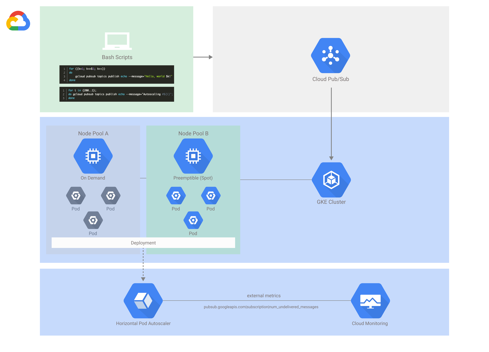

## An integration between Cloud Pub/Sub and GKE, leveraging preemptible and on-demand node pools
The ultimate goal of this application is to minimize cost whilst simultaneously maximizing throughput and uptime. 



_Figure 3 - GKE application leveraging autoscaling functionality to consume Pub/Sub messages with a Python backend_

The biggest risk with preemptible instances (soon to be Spot instances) would be impaired service due to delays in new resources being spun up to meet demand due to resource constraints within the region/zone or shutdown events.

#### Below are the steps to build this application from scratch.

-

1. Set the following environment variables for ease of use in all downstream steps:

	```sh
	PROJECT_ID=<Your project ID>
	REGION=<Your compute region>
	ZONE=<Your compute zone>
	CLUSTER_NAME=<Your cluster name>
	```

2. Clone the source code from Github:

	```sh
	git clone https://github.com/Rumeister/gke-pubsub-demo
	cd gke-pubsub-demo
	```
	
2. Set the defaults for the gcloud command line tool.

	```sh
	gcloud config set project $PROJECT_ID
	gcloud config set compute/zone $ZONE
	```

3. Create your GKE cluster, with [Workload Identity](https://cloud.google.com/kubernetes-engine/docs/how-to/workload-identity) enabled:

	```sh
	gcloud container clusters create $CLUSTER_NAME \
	--workload-pool=$PROJECT_ID.svc.id.goog
	--zone $ZONE \
	--machine-type=n2d-standard-2 \
	--num-nodes 1
	```
	> This will be the default pool, which will leverage on demand compute instances. With the node affinity configurations in a later section of this document, we will minimize the use of this node pool to maximize the utilization from the preemptible(spot) pool
	
4. Create the secondary node pool in the cluster. This will act as our _"primary"_ node pool to process Pub/Sub messages and will leverage preemptible(spot) instances exclusively. 

	```sh
	gcloud container node-pools create spot-pool \
	--cluster=$CLUSTER_NAME \
	--machine-type=n2d-standard-2 \
	--preemptible \
	--num-nodes 1 \
	--workload-metadata=GKE_METADATA
	```
	
5. Configure ```kubectl``` to communicate with the cluster

	```sh
	gcloud container clusters get-credentials $CLUSTER_NAME
	```
	
6. Create the Kubernetes service account to use for the application:

	```sh
	kubectl create serviceaccount gke-service-pubsub \
    --namespace default
	```
	>We will leverage the default K8S namespace, therefore eliminating the need to create a dedicated namespace.
	
7. Create an IAM service account for the application:

	```sh
	gcloud iam service-accounts create gke-service-pubsub \
    --description="Service Account used for Pub/Sub demo application with Workload Identity" \
    --display-name="gke-service-pubsub"
	```
	
8. Allow the Kubernetes service account to impersonate the Google service account by creating an IAM policy binding between the two. Assign the following roles ```monitoring.viewer``` and ```pubsub.subscriber``` to the newly created service account:
	
	```sh
	gcloud iam service-accounts add-iam-policy-binding gke-service-pubsub@$PROJECT_ID.iam.gserviceaccount.com \
    --role roles/iam.workloadIdentityUser \
    --member "serviceAccount:$PROJECT_ID.svc.id.goog[default/gke-service-pubsub]"
	```
	
	```sh
	gcloud projects add-iam-policy-binding $PROJECT_ID \
    --member "serviceAccount:gke-service-pubsub@$PROJECT_ID.iam.gserviceaccount.com" \
    --role "roles/pubsub.subscriber"
	```
	
	```sh
	gcloud projects add-iam-policy-binding $PROJECT_ID \
    --member "serviceAccount:gke-service-pubsub@$PROJECT_ID.iam.gserviceaccount.com" \
    --role "roles/monitoring.viewer"
	```
	
9. Add the ```iam.gke.io/gcp-service-account=GSA_NAME@PROJECT_ID``` annotation to the Kubernetes service account:

	```sh
	kubectl annotate serviceaccount gke-service-pubsub \
    --namespace default \
    iam.gke.io/gcp-service-account=gke-service-pubsub@$PROJECT_ID.iam.gserviceaccount.com
	```
	
	> **Optional**
	>
	> Test your Workload Identity configuration by creating a temporary Pod.
	>	
	> Create a Pod: 
	>
	> ```sh
	> kubectl apply -f ./deployment/wi-test.yaml
	> ```
	> 
	> Open an interactive session in the Pod:
	> 
	> ```sh
	> kubectl exec -it workload-identity-test \
	--namespace default -- /bin/bash
	> ```
	> 
	> You should now be connected to an interactive shell within the Pod. Run the below command:
	> 
	> ```sh
	> curl -H "Metadata-Flavor: Google" http://169.254.169.254/computeMetadata/v1/instance/service-accounts/
	> ```
	> 
	> The IAM service account you configured should be listed as the active identity.
	
10. To enable external metric evaluation, we'll need to install the [Stackdriver Adapter](https://github.com/GoogleCloudPlatform/k8s-stackdriver/tree/master/custom-metrics-stackdriver-adapter#configure-cluster):

	1. For GKE cluster-admin permissions on your cluster:
	
		```sh
		kubectl create clusterrolebinding cluster-admin-binding --clusterrole cluster-admin --user $(gcloud config get-value account)
		```
		
	2. Start the adapter, using the new resource model:

		```sh
		kubectl apply -f https://raw.githubusercontent.com/GoogleCloudPlatform/k8s-stackdriver/master/custom-metrics-stackdriver-adapter/deploy/production/adapter_new_resource_model.yaml
		```
		
	3. Because we have Workload Identity enabled, we'll also need to create the relevant IAM policy binding:

		```sh
		gcloud iam service-accounts add-iam-policy-binding --role \
  roles/iam.workloadIdentityUser --member \
  "serviceAccount:$PROJECT_ID.svc.id.goog[custom-metrics/custom-metrics-stackdriver-adapter]" \
  gke-service-pubsub@$PROJECT_ID.iam.gserviceaccount.com
		```
		
	4. Finally, we can annotate the service account:

		```sh
		kubectl annotate serviceaccount --namespace custom-metrics \
  custom-metrics-stackdriver-adapter \
  iam.gke.io/gcp-service-account=gke-service-pubsub@$PROJECT_ID.iam.gserviceaccount.com
		```
		
12. Create a new artifact repository where your custom docker image(s) will be pushed:

	```sh
	gcloud artifacts repositories create gke-pubsub-demo-repo --repository-format=docker --location=$REGION --description="GKE pubsub demo docker repository"
	```
	
13. Build your image (_The Dockerfile in the git repository is already preconfigured_):

	```sh
	docker build -t $REGION-docker.pkg.dev/$PROJECT_ID/gke-pubsub-demo-repo/gke-pubsub-demo:v1 .
	```
	> **Optional**
	>
	> Run: ```docker run --rm $REGION-docker.pkg.dev/$PROJECT_ID/gke-pubsub-demo-repo/gke-pubsub-demo:v1``` to test your newly built docker image locally before pushing it.
	
14. Next, authenticate the Docker cmdlet to Artifact Registry and push your locally built container image to the repository created earlier.

	```sh
	gcloud auth configure-docker $REGION-docker.pkg.dev

	docker push $REGION-docker.pkg.dev/$PROJECT_ID/gke-pubsub-demo-repo/gke-pubsub-demo:v1
	```
	
15. Create the Pub/Sub topic and subscription:

	```sh
	gcloud pubsub topics create echo
	gcloud pubsub subscriptions create echo-read --topic=echo
	```
	
16. Deploy the application to your GKE cluster using the ```pubsub.yaml``` deployment manifest:

	```sh
	kubectl apply -f ./deployment/pubsub.yaml
	kubectl get deployment
	kubectl get pods -l app=pubsub
	```
	> **Note**
	>
	> Update the image on line 18 to match your config for region and project as per the docker push 	commands above
	
17. Apply the HPA configuration to the application:

	```sh
	kubectl apply -f ./deployment/pubsub-hpa.yaml
	kubectl get hpa
	```
	
18. Run gcloud publish scripts to test scaling behavior

	```sh
	./pubsub-publish-script 250
	# -----run script-------x times
	# This script accepts a numeric parameter equal to the number of Pub/Sub messages you would like to publish. 
	# To run the script, you will need execute permissions on the file. 
	# You can enable this by running: chmod +x pubsub-publish-script
	```
	
	> An alternative script is also available in the repository: ```./pubsub-publish-script-countdown```
	
	As these scripts are running, either in isolation or in parallel, open two separate terminal windows and run the below commands:
	
	**_Terminal 1_**
	```watch kubectl get hpa```
	
	Example output:
	
	```sh
	NAME     REFERENCE           TARGETS        MINPODS   MAXPODS   REPLICAS   AGE
pubsub   Deployment/pubsub   0/200m (avg)   1         5         1          9d
	```
	
	**_Terminal 2_**
	```watch kubectl get pods -o wide``` 
	
	Example output:
	
	```sh
	NAME                     READY   STATUS    RESTARTS   AGE   IP          NODE                                      NOMINATED NODE   READINESS GATES
pubsub-d99cfddff-k26kq   1/1     Running   0          29m   10.0.8.24   gke-pubsub-test-spot-pool-3f1f7801-ldhs   <none>           <none>
	```
	
	> You will notice that as pods begin to scale, node selection will vary between the spot pool and the on-demand pool. This is not the desired behavior as we would prefer scaling to occur with a preference for the spot pool and only leverage the on-demand pool when spot resources aren't available. 
	
19. To accommodate our goal, we'll use NodeAffinity with ```preferredDuringSchedulingIgnoredDuringExecution``` and update our existing deployment by running:

	```sh
	kubectl apply -f ./deployment/pubsub-node-aff.yaml
	```
	
	> You can also use custom node labels or view the existing labels at the node level by running:
	>
	> ```sh
	> kubectl get nodes
	> kubectl describe node "nodename"
	> ```
	> 
	> in our example, it would be:
	>
	> ```sh
	> kubectl get nodes
	> 
	> NAME                                         STATUS   ROLES    AGE    VERSION
gke-pubsub-test-default-pool-c2c1e90a-cp2s   Ready    <none>   2d1h   v1.20.10-gke.1600
gke-pubsub-test-spot-pool-3f1f7801-ldhs      Ready    <none>   28h    v1.20.10-gke.1600
	> 
	> kubectl describe node gke-pubsub-test-spot-pool-3f1f7801-ldhs
	> ```
	>
	> Some example labels you'd expect to see:
	>
	> 	 
	    cloud.google.com/gke-boot-disk=pd-standard
	    cloud.google.com/gke-container-runtime=containerd
	    cloud.google.com/gke-netd-ready=true
	    cloud.google.com/gke-nodepool=spot-pool
	    cloud.google.com/gke-os-distribution=cos
	    cloud.google.com/gke-preemptible=true
	    cloud.google.com/machine-family=n2d
	
Repeat the steps in **18.** above and notice how pods are only scheduled on the spot node pool.

### Considerations
It is recommended to always have a stable node-pool configured that is not dependent on preemptible/spot capacity as there is no SLA related to those resources. The sizing of node-pools would be dependent on your planned workloads. Some additional thoughts:

- The tolerance for throttled response times from Pub/Sub due to subscribers not being readily available should be determined and thoroughly tested. There should be a threshold for maximizing preemptible/spot utilization vs. having a durable and highly available environment.
- Depending on the SLO/SLA decision, you could leverage [_Node auto-provisioning (NA*)_](https://cloud.google.com/kubernetes-engine/docs/how-to/node-auto-provisioning#mark_node_auto-provisioned) in conjunction with the above solution to allow GKE to automatically scale node pools up or down. 
- Consider leveraging _NA*_ only for preemptible/spot pool configurations, whilst keeping other node pool(s) static. This way, you don't run the risk of ever having service downtime due to preemptible/spot capacity challenges or needing to spin up on demand node pools manually when _NA*_ potentially scaled your on demand pool down to zero.
- [Best practices for HA](https://cloud.google.com/blog/products/containers-kubernetes/best-practices-for-creating-a-highly-available-gke-cluster)
- Another alternative would be Cloud Run. 
	
	[GKE preemptible node pool vs Cloud Run cost comparison](https://cloud.google.com/products/calculator/#id=f48fa35f-83b4-42f1-addc-982247b7f4ab)
